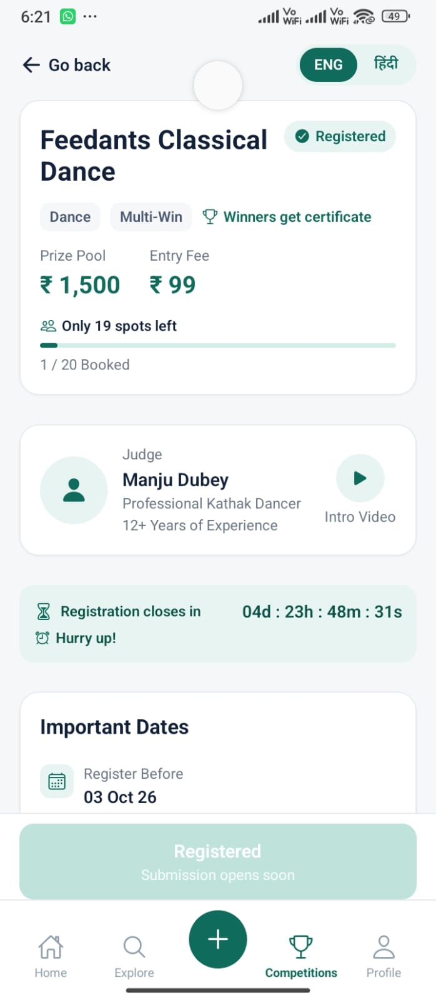
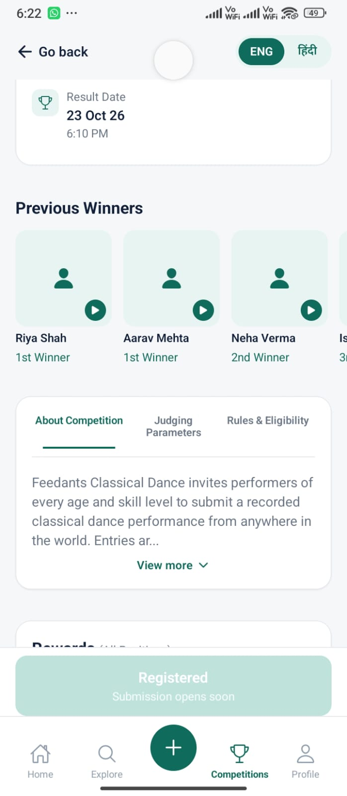
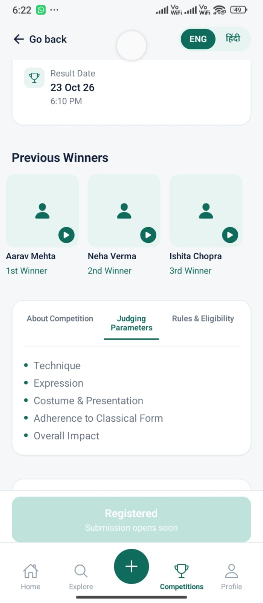
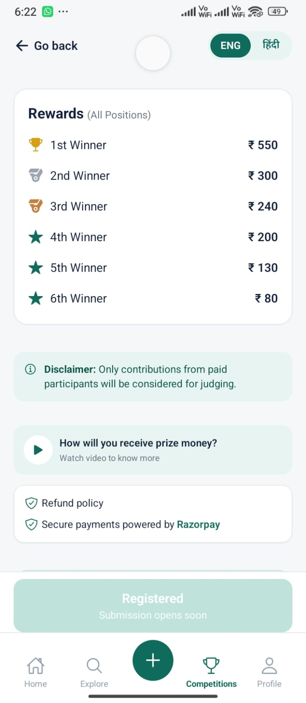
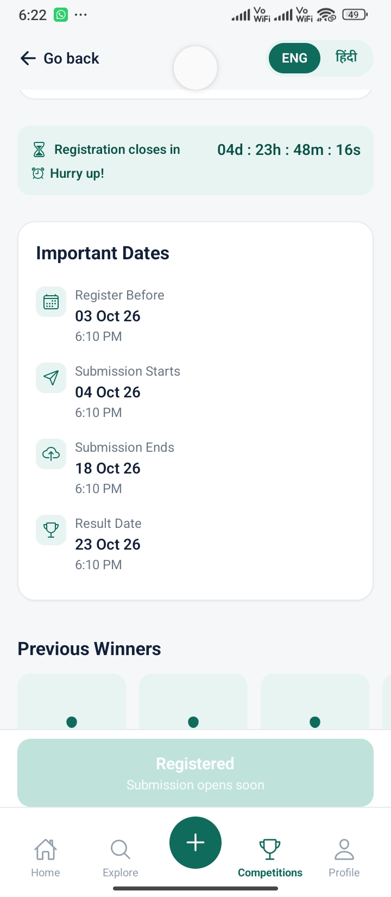
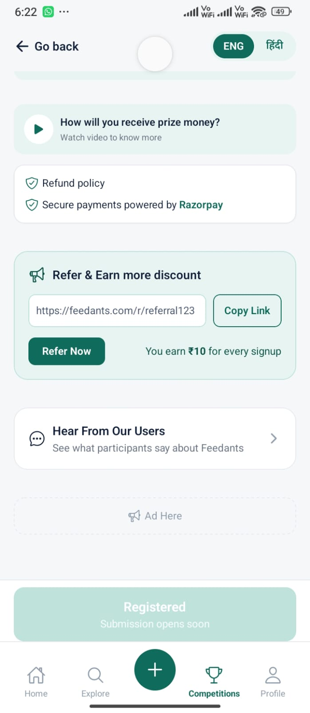

# Feedants Competition Details

A functional full-stack Competition Details module built for the **Feedants Full Stack Developer Internship Assignment**.

The application provides a React Native competition details screen backed by a Node.js, Express.js, TypeScript, and MongoDB API.

The implementation focuses on dynamic backend-driven competition data, registration lifecycle, availability, user registration state, submission flow, countdown handling, database consistency, and a responsive mobile UI based on the provided Feedants design reference.

---

## Demo

The application was tested on a physical Android device using Expo Go with the backend running locally on the development machine.

The mobile application dynamically fetches competition information from the backend API instead of using hardcoded competition data in the React Native UI.

---

# Screenshots

The following screenshots show the implemented Competition Details screen across different sections of the mobile application.

### Competition Overview



### Important Dates & Previous Winners



### Competition Information



### Rewards & Prize Information



### Registration Countdown & Competition Details



### Referral, Testimonials & Advertisement



---

# Features

## Mobile Application

- Competition details screen
- Backend-driven competition data
- Competition category and tags
- Prize pool
- Entry fee
- Registration capacity
- Remaining spots
- Registration status
- Judge information
- Previous winners
- Competition rewards
- Important competition dates
- Registration countdown
- Competition lifecycle states
- Registration state
- Submission state
- About competition section
- Judging parameters
- Rules and eligibility
- Refund policy
- Payment information
- Referral section
- User testimonials section
- Advertisement placeholder
- Bottom navigation UI
- Loading state
- Error state
- Responsive mobile layout
- Server-time based countdown
- Dynamic remote images
- External video/reference actions

---

# Backend Features

- Node.js
- Express.js
- TypeScript
- MongoDB
- Mongoose
- JWT authentication
- Demo authentication flow
- Zod request validation
- Competition lifecycle management
- Registration management
- Submission management
- Capacity validation
- Duplicate registration protection
- Atomic registration capacity update
- MongoDB compound indexes
- Centralized error handling
- Authentication middleware
- Rate limiting
- Helmet security headers
- CORS configuration
- Server-side time handling

---

# Tech Stack

## Frontend

- React Native
- Expo SDK 54
- React 19
- TypeScript
- NativeWind
- Tailwind CSS
- Expo SecureStore
- Expo Vector Icons
- React Native Safe Area Context

## Backend

- Node.js 20
- Express.js
- TypeScript
- MongoDB
- Mongoose
- JWT
- Zod
- Helmet
- CORS
- Express Rate Limit

---

# Project Structure

```text
Feedants-Application/
│
├── mobile/
│   ├── src/
│   │   ├── components/
│   │   │   ├── competition/
│   │   │   └── navigation/
│   │   ├── constants/
│   │   ├── hooks/
│   │   ├── screens/
│   │   ├── services/
│   │   ├── types/
│   │   └── utils/
│   │
│   ├── App.tsx
│   ├── index.ts
│   ├── package.json
│   ├── app.json
│   ├── babel.config.js
│   ├── metro.config.js
│   ├── tailwind.config.js
│   ├── global.css
│   └── .env.example
│
├── server/
│   ├── src/
│   │   ├── config/
│   │   ├── controllers/
│   │   ├── middleware/
│   │   ├── models/
│   │   ├── routes/
│   │   ├── services/
│   │   ├── seed/
│   │   ├── types/
│   │   ├── utils/
│   │   ├── validators/
│   │   ├── app.ts
│   │   └── server.ts
│   │
│   ├── package.json
│   ├── tsconfig.json
│   └── .env.example
│
├── images/
│   ├── image1.jpeg
│   ├── image2.jpeg
│   ├── image3.jpeg
│   ├── image4.jpeg
│   ├── image5.jpeg
│   └── image6.jpeg
│
├── .gitignore
└── README.md


#Architecture

The backend follows a layered architecture:

Routes
   ↓
Controllers
   ↓
Services
   ↓
Mongoose Models
   ↓
MongoDB

The React Native application communicates with the backend through a dedicated API service layer.

The overall data flow is:

MongoDB
   ↓
Mongoose
   ↓
Express API
   ↓
React Native API Client
   ↓
React Native State
   ↓
Competition Details UI

Competition information, lifecycle information, registration state, availability, judge information, winners, rewards, and other competition data are returned by the backend API.

Backend Setup
Prerequisites

Install:

Node.js 20.x
npm
MongoDB Atlas or a local MongoDB instance

The project was developed using Node.js 20.x.

1. Install Backend Dependencies

From the project root:

cd server
npm install
2. Configure Backend Environment Variables

Create:

server/.env

using:

server/.env.example

Example:

PORT=5000
MONGODB_URI=mongodb+srv://<username>:<password>@<cluster-url>/feedants?retryWrites=true&w=majority
JWT_SECRET=replace-with-a-long-random-string
JWT_EXPIRES_IN=7d
NODE_ENV=development
Environment Variables
Variable	Description
PORT	Backend HTTP port
MONGODB_URI	MongoDB connection string
JWT_SECRET	Secret used for JWT signing
JWT_EXPIRES_IN	JWT expiration duration
NODE_ENV	Application environment

Never commit the actual .env file. It contains private database credentials and secrets.

MongoDB Setup

MongoDB Atlas can be used for development.

Create a database user and obtain the MongoDB connection string.

Example:

mongodb+srv://<username>:<password>@<cluster-url>/feedants?retryWrites=true&w=majority

Add the connection string to:

server/.env

The seed script creates the competition and demo user automatically.

Seed the Database

Run:

cd server
npm run seed

The seed script creates or updates:

Feedants Classical Dance competition
Demo user
Competition information
Judge information
Previous winners
Rewards
Important dates
Rules
Eligibility
Referral information

The seed command prints the competition ID.

Example:

[seed] Competition ready: <competition-id> - Feedants Classical Dance
[seed] Demo user ready: <user-id> - demo@feedants.com
[seed] Done.

Use the generated competition ID in the mobile application's environment configuration.

The seed operation is designed to be repeatable without creating duplicate competition records.

Start the Backend
cd server
npm run dev

The backend runs on:

http://localhost:5000

Health endpoint:

GET /api/health

Example:

http://localhost:5000/api/health
Mobile Application Setup

Open another terminal from the project root.

cd mobile
npm install
Mobile Environment Variables

Create:

mobile/.env

using:

mobile/.env.example

Required variables:

EXPO_PUBLIC_API_BASE_URL=<backend-url>
EXPO_PUBLIC_COMPETITION_ID=<competition-id>
Android Emulator

For an Android emulator running on the same development machine:

EXPO_PUBLIC_API_BASE_URL=http://10.0.2.2:5000
EXPO_PUBLIC_COMPETITION_ID=<competition-id>

10.0.2.2 maps to the host machine from the Android emulator.

Physical Android Device

For a physical Android device using Expo Go:

EXPO_PUBLIC_API_BASE_URL=http://<YOUR-COMPUTER-LAN-IP>:5000
EXPO_PUBLIC_COMPETITION_ID=<competition-id>

For example:

EXPO_PUBLIC_API_BASE_URL=http://192.168.1.10:5000
EXPO_PUBLIC_COMPETITION_ID=<competition-id>

The phone and development computer must be connected to the same network.

The backend must also be running.

Start the React Native Application
cd mobile
npm start

If environment variables were changed, clear the Expo cache:

npx expo start --clear

Then open the application using Expo Go.

API Endpoints
Health Check
GET /api/health

Checks backend availability and database connection status.

Demo Authentication
POST /api/auth/demo

Creates/authenticates the demo user and returns an authentication token.

Get Competition Details
GET /api/competitions/:competitionId

Returns:

Competition details
Prize pool
Entry fee
Capacity
Remaining spots
Registration status
Competition lifecycle
User registration state
Server time
Judge information
Previous winners
Rewards
Important dates
Rules
Eligibility
Referral information
Get Competition Winners
GET /api/competitions/:competitionId/winners

Returns previous winner information.

Register for Competition
POST /api/competitions/:competitionId/register

Requires authentication.

Registration is allowed only when the competition lifecycle permits registration.

Submit Performance
POST /api/competitions/:competitionId/submission

Requires authentication and an eligible competition state.

Competition Lifecycle

The competition state is calculated by the backend using server-side timestamps.

The supported lifecycle states are:

UPCOMING
REGISTRATION_OPEN
REGISTRATION_CLOSED
SUBMISSION_OPEN
SUBMISSION_CLOSED
RESULT_DECLARED

The mobile application uses the lifecycle state returned by the backend to determine the appropriate UI and actions.

This avoids relying solely on the device's local clock.

Countdown Handling

The backend returns:

serverTime

along with the competition information.

The mobile application calculates the countdown using the server-provided time and the relevant lifecycle boundary.

This reduces inconsistencies caused by differences between the device clock and server clock.

Registration Capacity & Concurrency

The competition has a fixed registration capacity.

Registration uses an atomic MongoDB update:

registeredCount < capacity

before incrementing the registration count.

Conceptually:

Request A ──┐
Request B ──┤
Request C ──┼──> Atomic database update
Request D ──┤
Request E ──┘
                 ↓
        registeredCount < capacity
                 ↓
          Registration allowed

This is important because checking capacity only in application code could allow multiple concurrent requests to pass the check before any of them updates the count.

A compound unique index on:

competitionId + userId

also prevents duplicate registrations for the same user and competition.

Important Assumptions

The following assumptions were made while implementing the assignment:

1. Single Competition Details Module

The assignment focuses on the Competition Details screen, so the mobile application is intentionally implemented around the provided competition details flow rather than building a complete multi-screen competition discovery application.

2. Demo Authentication

A lightweight demo authentication flow is used because the assignment focuses on the competition module rather than a complete production identity system.

JWT is used to represent the authenticated user between the mobile application and backend.

3. Demo Competition Data

The competition is seeded into MongoDB using the provided seed script.

This keeps the mobile application dynamic while making the assignment easy to run and evaluate.

4. No Real Payment Integration

The competition contains an entry fee and payment-provider information, but real payment processing is outside the scope of this assignment.

No real financial transaction is performed by the implementation.

5. Submission Reference

The submission flow accepts a submission reference/URL rather than implementing a complete video-upload infrastructure.

A production implementation would normally use object storage and an upload service.

6. Remote Images

Judge and previous-winner images are represented as remote URLs stored in the competition data and returned through the API.

The mobile application does not hardcode those image URLs.

Major Technical Decisions
1. React Native + Expo

Expo was selected to simplify React Native development, device testing, and assignment evaluation.

It also allows the application to be tested quickly on a physical Android device using Expo Go.

2. NativeWind

NativeWind was used to provide Tailwind-style utility classes while keeping the implementation within React Native.

This allowed the UI to remain consistent with the spacing, typography, colors, borders, and responsive layout requirements of the provided reference design.

3. Layered Backend Architecture

The backend follows:

Routes
   ↓
Controllers
   ↓
Services
   ↓
Models

Business rules are kept inside services rather than placing business logic directly inside route handlers.

This makes the backend easier to maintain and extend.

4. MongoDB + Mongoose

MongoDB was selected because the competition data contains nested structures such as:

Judge
Previous winners
Rewards
Referral information
Rules
Eligibility

Mongoose provides schema validation, indexes, and a clean TypeScript-friendly model layer.

5. Server-Driven Competition State

The backend determines the current competition lifecycle instead of allowing the mobile client to independently decide whether registration or submission is open.

This keeps business rules centralized.

6. Atomic Registration Update

Registration capacity is protected at the database operation level rather than relying only on frontend validation.

This was chosen specifically because the assignment mentions multiple users and concurrent registration requests.

Trade-offs
1. Demo Authentication vs Full Authentication

A demo authentication flow was implemented instead of a complete email/password or OAuth authentication system.

Benefit
Faster to implement
Keeps the focus on the assignment
Still demonstrates authenticated API requests and JWT handling
Trade-off

It is not a complete production identity system.

2. Remote Images vs Image Storage

Images are stored as URLs rather than uploading them to an object-storage service.

Benefit
Simple setup
No additional storage infrastructure
Keeps image data dynamic through the backend
Trade-off

Production systems should generally use managed object storage/CDNs with ownership, caching, optimization, and availability guarantees.

3. Local Backend vs Deployed Backend

The application was tested with the backend running on the local development machine.

Benefit
Fast development
Easy debugging
No deployment dependency during implementation
Trade-off

A production submission would normally use a deployed API accessible through HTTPS.

4. Single-Screen Mobile Architecture

A full navigation framework was not introduced because the assignment focuses on one main screen.

Benefit
Fewer dependencies
Simpler architecture
Faster startup and development
Trade-off

A larger production application would benefit from a dedicated navigation architecture.

5. Submission URL Instead of Video Storage

The submission flow uses a reference/URL rather than implementing a complete video upload pipeline.

Benefit
Keeps the assignment focused on competition logic
Avoids large file-upload infrastructure
Trade-off

A production application would require upload validation, object storage, signed URLs, file-size limits, content validation, and background processing.

Production Improvements

If this module were developed further for production, I would improve the following areas.

Backend
Deploy the API behind HTTPS
Use a production authentication provider
Implement refresh-token/session management
Add stronger authorization rules
Add MongoDB transactions where multi-document atomicity is required
Add automated integration and concurrency tests
Add structured logging
Add monitoring and alerting
Add distributed rate limiting
Add API versioning
Add request tracing
Add automated database migrations
Add background processing for video submissions
Add object storage such as S3 for uploaded videos
Add CDN support for images and videos
Add stronger validation and file scanning
Mobile
Add proper navigation architecture
Add offline/error recovery strategies
Add image caching
Add pagination where required
Add accessibility testing
Add analytics
Add push notifications
Add production authentication
Add automated UI tests
Add release builds through EAS
Add production environment configuration
Infrastructure

A production deployment could be structured as:

React Native App
       ↓
HTTPS API
       ↓
Load Balancer
       ↓
Node.js API Instances
       ↓
MongoDB
       ↓
Object Storage / CDN

This would provide better scalability, availability, monitoring, and deployment flexibility.

Validation & Error Handling

The backend uses:

Zod request validation
Centralized API error handling
Authentication middleware
Competition lifecycle validation
Capacity validation
Duplicate registration protection
HTTP status codes
Rate limiting
Helmet security headers

The mobile application handles:

Loading states
API failures
Retry scenarios
Registration state
Submission state
Countdown state
Backend-driven lifecycle changes
Verification Performed

The following development checks were performed during implementation:

Backend
TypeScript type checking
Production TypeScript build
MongoDB Atlas connection
Database seed
Health endpoint verification
Competition API verification
Dynamic competition data retrieval
Mobile
TypeScript type checking
Expo build/export verification
Physical Android device testing
Backend connectivity from physical device
Dynamic competition data displayed from API
Countdown rendering
Responsive scrolling and section layout
Environment & Security

The following files are intentionally excluded from Git:

.env
.env.local
node_modules/
dist/
.expo/

#Author
Ashish More

